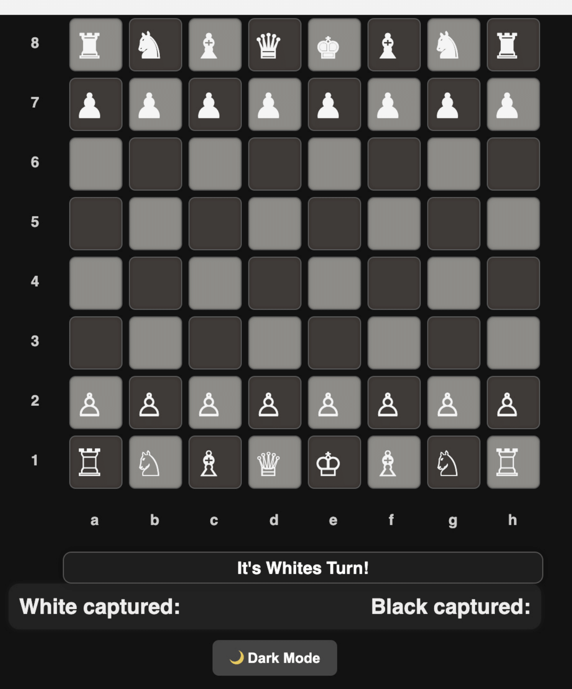

# ♟️ Web Chess Game — HTML/CSS/JS

This is a **web-based chess game** built entirely with **HTML**, **CSS**, and **JavaScript (jQuery)**. It includes:

- 🎨 A modern UI with **highlight effects**, **neon animations**, and **dark mode**
- ♟️ Full piece movement logic
- ♻️ Turn-by-turn interaction
- 🔄 Display of captured pieces
- 🌙 A toggleable **dark mode**

> 🧠 **Planned**: Integration of AI opponent with difficulty selection using **Stockfish**

---

## 🔧 Files

- `Code-Source/index.html` — UI layout and buttons
- `Code-Source/style.css` — Visual design, animations, dark mode
- `Code-Source/script.js` — Main logic for turns, movements, capturing

---

## 🚀 Getting Started

1. Clone this repo:
   ```bash
   git clone https://github.com/Bellilty/Web-Chess-Game.git
   ```

2. Open `index.html` in a browser (or with Live Server in VS Code).

> No server required — the game runs entirely in the browser.

---

## 🌍 Deploy Online (via GitHub Pages)

You can publish your chess game online using GitHub Pages:

1. Push your project to a public GitHub repository
2. Go to **Settings > Pages**
3. Under **Source**, select the root folder or `/main`
4. Save — your game will be live at:

```
https://yourusername.github.io/your-repo-name/
```

---

## ✅ Features

- Legal move highlighting
- Piece capture and turn logic
- Captured piece display
- Dark/light theme toggle

---

## 🧠 Roadmap (Coming Soon)

- Stockfish-powered AI opponent (via CDN or WASM)
- Difficulty selector
- Move history panel
- Sounds (move, capture)
- Timers and clocks
- Evaluation bar (Lichess-style)

---

## 📚 Credits & License

This project is based on code by **@awsomeCStutorials**, originally published at:

🔗 https://github.com/awsomeCStutorials/chess-game  
Licensed under the MIT License.

Modified and customized by **Simon Bellilty**  
(Styling, dark mode, improved UX, layout rework, upcoming AI integration)

---

## 🗂 License

Open source, MIT License.  
Free to modify, improve, and use for educational or personal projects.

---

## 🖼 Preview

### Light Mode


### Dark Mode


---

If you enjoy this project, feel free to star ⭐, fork 🍴, or contribute!
